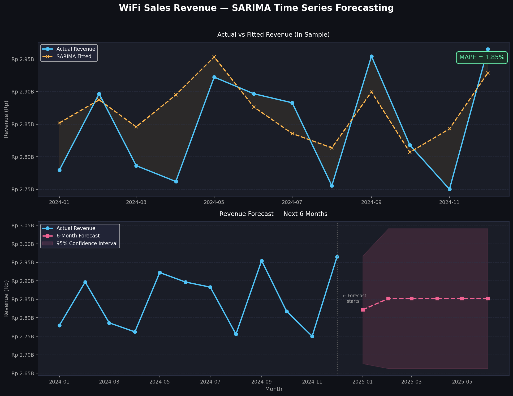
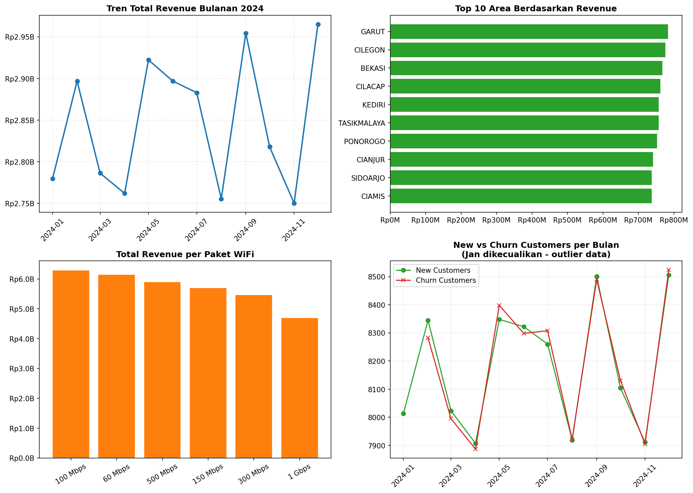

# Predictive Business Intelligence Dashboard for WiFi Sales Optimization

A web-based Business Intelligence (BI) dashboard designed to analyze and forecast WiFi service sales performance. This project bridges data engineering, exploratory data analysis (EDA), and machine learning to provide actionable insights for infrastructure budgeting and revenue optimization.

## 📌 Project Overview
In the telecommunications sector, understanding demand patterns is critical for capacity planning. This project processes historical WiFi sales data from an internet service provider partner, conducts stationarity and trend analysis, and deploys a SARIMA (Seasonal Autoregressive Integrated Moving Average) model to predict future subscription metrics.

## 🚀 Key Features
* **Automated Data Pipeline:** End-to-end Python scripts handling data loading, structural cleaning, and outlier preprocessing.
* **Exploratory Data Analysis (EDA):** Deep-dive analysis on sales trends, seasonality behavior, and statistical stationarity tests.
* **Time Series Forecasting:** Predictive modeling utilizing the SARIMA algorithm to forecast sales trends for the next 6 months.
* **Interactive Visualization:** Business Intelligence dashboard interface providing intuitive graphs for corporate decision-makers.

## 🛠️ Tech Stack & Libraries
* **Language:** Python
* **Data Manipulation:** Pandas, NumPy
* **Statistical Modeling & Forecasting:** Statsmodels (SARIMA)
* **Data Visualization:** Matplotlib, Seaborn, Streamlit / Ion Framework (Dashboard interface)

## 📁 Repository Structure
* `01_load_preprocessing.py`: Data ingestion, structural alignment, and missing value treatments.
* `02_eda_stationarity.py`: Seasonal decomposition and stationarity testing (ADF test).
* `03_sarima_modeling.py`: Model training, hyperparameter tuning, and forecasting configuration.
* `04_forecast_evaluation.py`: Performance evaluation calculations.
* `05_business_insight.py`: Script to generate core executive business summaries.

## 📊 Analytics & Visual Insights

### 1. Sales Forecasting (Next 6 Months)
Below is the visualized prediction generated by the SARIMA model, outlining future demand patterns to prevent server over-provisioning or capacity shortages:

### 2. Strategic Business Dashboard
Executive view summarizing key performance indicators (KPIs), structural sales growth, and targeted revenue trends:

## 📈 Model Performance
The predictive engine is evaluated using standard forecasting metrics to ensure accuracy in industrial applications:
* **Mean Absolute Percentage Error (MAPE):** *[Silakan buka file `mape_value.txt` Anda dan tuliskan angka persentasenya di sini, contoh: 5.4%]* 

## 💡 Key Business Impact
1. **Data-Driven Budgeting:** Shifts procurement planning from intuitive guessing to actual mathematical forecasting models.
2. **Infrastructure Readiness:** Enables the network engineering team to allocate bandwidth and access points ahead of forecasted high-demand periods.
